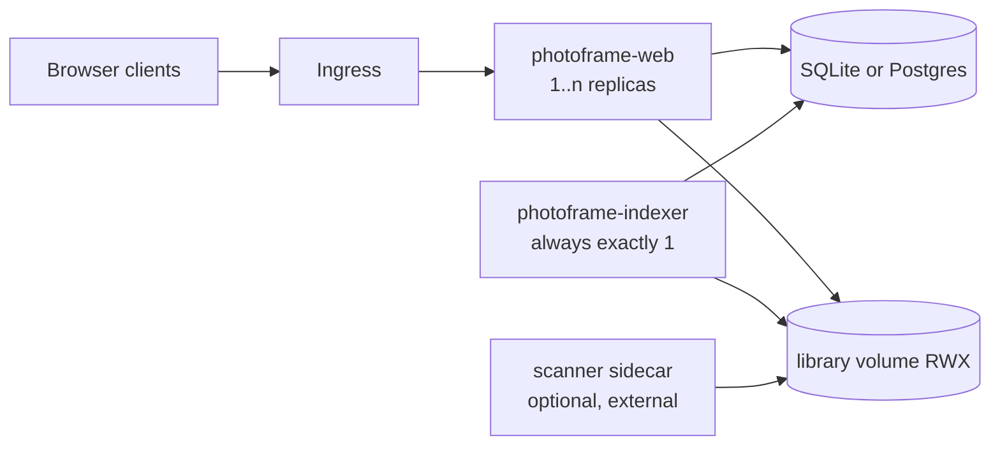
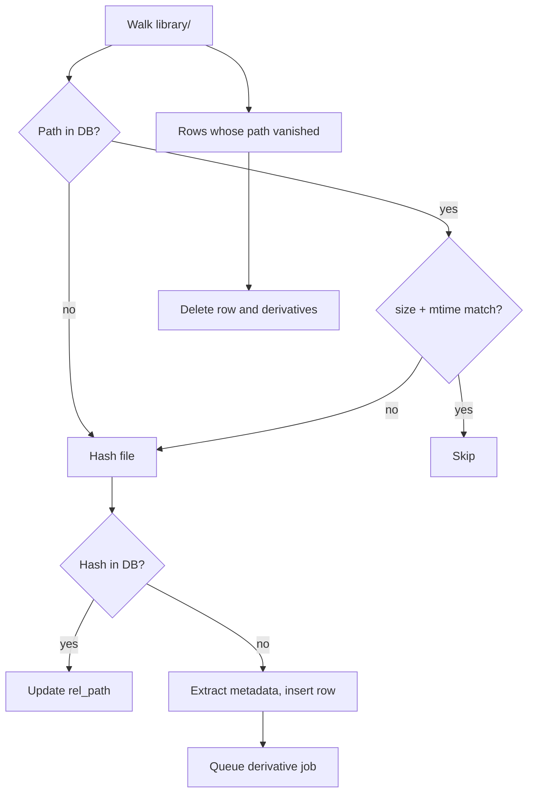

# Photo Frame App — Implementation Spec

2026-09-20 · @Someone

## Overview

A self-hosted digital photo frame. A Rust backend indexes a folder of photographs, generates display-ready derivatives, and serves them to browser clients on the LAN. The primary client is an iPad Pro 11-inch on iPadOS 26.6.1, installed to the home screen as a PWA and locked in place with Guided Access.

The project exists because the built-in iPad slideshow gives no control over pacing or ordering. Per-client control of dwell time, ordering mode and tag filtering is the point of the product, not a secondary feature.

### Goals

- Photographs live in a mounted folder. The application never knows what is behind that mount.
- Every client controls its own display behaviour, persisted in the browser.
- Touch interaction feels native: gestures, no browser chrome, no visible latency.
- Shared state (tags, favourites, corrected dates) is visible to everyone and survives loss of the database.
- One application serves both the frame view and the management view, across desktop and mobile browsers.

### Non-goals for v1

| Excluded | Why, and what replaces it |
| --- | --- |
| Remote ingest | Nothing is exposed outside the LAN. Photographs arrive by landing in the library folder. |
| Email ingest | Deferred until a local mail server exists. It will be a separate deployment writing into `incoming/`, not part of this codebase. |
| Cloud storage | No Nextcloud, no object storage, no sync clients. Mounted volumes only. |
| Video and Live Photos | Stills only. The schema carries a media type so this is additive. |
| SSO | Management uses HTTP Basic auth from a Kubernetes secret, behind a middleware seam for Entra later. |
| Malware scanning | An external deployment operating on the directory contract in §3. |
| High availability | Single replica. The database is disposable and rebuildable. |

### How to read this document

It is written to be implemented by coding agents. Where a decision has been made it is stated as a requirement, not an option. Where genuine latitude exists it is marked *implementer's choice*.

## Deployment topology

Two binaries, two images, two workloads. `photoframe-web` serves the API and static assets. `photoframe-indexer` walks the library, generates derivatives and maintains the index. They share nothing but the database and the library volume, and they are deployed independently.

The database backend is selected by `DATABASE_URL`, and that choice is what constrains the topology:

| `DATABASE_URL` | Topology | Web replicas |
| --- | --- | --- |
| `sqlite://…` | Both containers in one pod, sharing a volume | 1 |
| `postgres://…` | Two Deployments, database hosted by the admin | Any |

SQLite across two processes is fine when they are containers in the same pod: they share a volume, the same kernel and real POSIX locking, and WAL mode gives one writer with many concurrent readers. It is not fine across pods, because that would mean NFS, and SQLite on NFS corrupts. Postgres removes the constraint entirely. Hosting it correctly is the administrator's problem, not the application's.



### Workloads

| Workload | Replicas | Strategy | Notes |
| --- | --- | --- | --- |
| `photoframe-web` | 1..n | RollingUpdate | Stateless. Scale freely on Postgres |
| `photoframe-indexer` | exactly 1 | Recreate | Never run two. See the leader note below |
| Malware scanner | optional | — | External image, not in this codebase |

The indexer must be a singleton. Two indexers would race on derivative generation and promotion from `incoming/`. Enforce it with `replicas: 1` and `strategy: Recreate`, and additionally take an advisory lock at startup — `pg_try_advisory_lock` on Postgres, an exclusive row in a `singleton` table on SQLite — so a misconfigured second instance exits loudly rather than corrupting state.

### How web learns about changes

A `generation` counter in the database, incremented by the indexer on any change to the indexed set and by the web tier on any shared-state mutation. Web reads it to build the manifest `ETag`. No inter-process messaging, no queue, no shared memory.

### Volumes

- **Library volume** at `LIBRARY_ROOT`, `ReadWriteMany`, mounted by both workloads. Expected to be NFS. The web tier reads derivatives and writes uploads into `incoming/`; the indexer does everything else.
- **State volume**, SQLite only, mounted by the single pod holding both containers. Not present in the Postgres topology.

No `hostPath`, no node affinity, no assumptions about POSIX locking on the library volume.

### Startup and shutdown

Both binaries connect to the database and run migrations on start; migrations are idempotent and safe to attempt concurrently. The web tier serves immediately and reports `indexing` status read from the database rather than from its own state.

On `SIGTERM`: the web tier drains connections; the indexer finishes or cancels in-flight derivative jobs, releases its advisory lock, and exits. Give the indexer a generous `terminationGracePeriodSeconds`.

## Storage layout

The directory contract is the integration surface between this application and everything external to it. Any process that can write files into these directories can feed the frame.

```
$LIBRARY_ROOT/
  incoming/              # arrivals, unscanned, not served
  quarantine/            # written by the external scanner, never read by the app
  library/               # canonical originals, never modified in place
  derivatives/           # generated, disposable, content-addressed
    ab/cd/abcd1234....-2388.avif
  exports/
    curation-20260920.json # written on demand, never read automatically

$STATE_ROOT/             # SQLite topology only
  photoframe.db          # WAL mode
```

### Rules

1. Files in `library/` are never modified. Rotation, date correction and tagging change database rows, not bytes on disk.
2. Deletion from the management view removes the file from `library/` and its derivatives, then removes the row. Originals are genuinely deleted, which is what makes the next scan simple: present on disk and absent from the database means new; absent from disk and present in the database means removed.
3. `derivatives/` is fully disposable. Deleting it costs regeneration time and nothing else.
4. Files are placed into `library/`. The structure doesn't matter and should be fully recursed. The database is the authority on ordering.
5. Filename collisions are resolved by appending `-1`, `-2` and so on. Content-identical files are detected by hash and the duplicate is discarded rather than stored twice.

### Promotion

When `INGEST_REQUIRE_SCAN=true`, the application treats `incoming/` as read-only and waits for the external scanner to move files into `library/`. When `false`, the application promotes them itself after validation. Either way, the scanner in §5 only ever indexes what is already in `library/`.

### Curation export

Tags, tag assignments, favourites and date overrides are the only state not derivable from the photographs themselves. The database is authoritative for them, and backing the database up is the administrator's responsibility.

An export exists so curation can travel with the photographs rather than being locked inside a database the next person has to reconstruct. It is explicit, never automatic:

- `POST /api/export` writes `exports/curation-YYYYMMDD.json` and returns the path
- `photoframe-indexer export --out <path>` does the same from the CLI, suitable for a CronJob
- `photoframe-indexer import --in <path>` merges an export into the current database, keyed by content hash

Import is a merge, not a replace. It adds tags and sets favourites and overrides, and never clears anything the export does not mention. Entries for hashes absent from the library are skipped rather than treated as errors, so an export taken before a deletion still applies cleanly.

Nothing reads this file automatically. An empty database stays empty of curation until someone imports.

## Data model

`sqlx` behind a `Store` trait with two implementations, SQLite and Postgres, selected at startup from `DATABASE_URL`. Migrations are embedded in both binaries and are idempotent. Because `sqlx`'s compile-time macros are backend-specific, queries live inside the trait implementations rather than being shared; keep the trait's surface narrow so the duplication stays bounded.

### Identity

A photograph's identity is the BLAKE3 hash of its file contents, hex-encoded. This is the primary key everywhere, it is what the curation export is keyed by, and it is what derivative filenames are built from. Renaming or moving a file does not change identity; re-encoding it does, and produces a new photograph.

### Schema

```sql
CREATE TABLE photos (
  hash            TEXT PRIMARY KEY,
  rel_path        TEXT NOT NULL UNIQUE,   -- relative to library/
  media_type      TEXT NOT NULL,          -- 'image' in v1; 'video','live' reserved
  mime            TEXT NOT NULL,
  byte_size       INTEGER NOT NULL,
  width           INTEGER NOT NULL,
  height          INTEGER NOT NULL,
  orientation     INTEGER NOT NULL DEFAULT 1,
  taken_at        TEXT,                   -- EXIF DateTimeOriginal, RFC 3339, nullable
  file_mtime      TEXT NOT NULL,
  date_override   TEXT,                   -- set in management view
  date_source     TEXT NOT NULL,          -- 'exif' | 'mtime' | 'override'
  favorite        INTEGER NOT NULL DEFAULT 0,
  derivatives_ok  INTEGER NOT NULL DEFAULT 0,
  rotation        INTEGER NOT NULL DEFAULT 0,   -- degrees clockwise, curated: 0, 90, 180, 270
  derivatives_rotation INTEGER NOT NULL DEFAULT 0, -- rotation the derivatives on disk were made for
  indexed_at      TEXT NOT NULL
);

CREATE TABLE tags (
  id        INTEGER PRIMARY KEY,
  name      TEXT NOT NULL UNIQUE COLLATE NOCASE,
  created_at TEXT NOT NULL
);

CREATE TABLE photo_tags (
  photo_hash TEXT NOT NULL REFERENCES photos(hash) ON DELETE CASCADE,
  tag_id     INTEGER NOT NULL REFERENCES tags(id) ON DELETE CASCADE,
  PRIMARY KEY (photo_hash, tag_id)
);

CREATE INDEX idx_photos_effective_date ON photos(COALESCE(date_override, taken_at, file_mtime));
CREATE INDEX idx_photo_tags_tag ON photo_tags(tag_id);
```

`effective_date` is `COALESCE(date_override, taken_at, file_mtime)` and is what every ordering mode sorts by. Expose it as a computed field in the API rather than storing it.

### Dialect notes

The schema above is written in SQLite dialect. The Postgres implementation differs in four places and nowhere else:

| SQLite | Postgres |
| --- | --- |
| `INTEGER` booleans | `BOOLEAN` |
| `TEXT` timestamps, RFC 3339 | `TIMESTAMPTZ` |
| `INTEGER PRIMARY KEY` for `tags.id` | `GENERATED ALWAYS AS IDENTITY` |
| `COLLATE NOCASE` on `tags.name` | `CITEXT`, or a unique index on `lower(name)` |

Both carry a `meta` table holding the `generation` counter and the schema version, and a `singleton` table used for the indexer's advisory lock on SQLite.

### Derived versus authoritative

| Column | Class | If lost |
| --- | --- | --- |
| `rel_path`, `mime`, `byte_size`, `width`, `height`, `orientation`, `taken_at`, `file_mtime`, `indexed_at` | Derived | Recovered by rescanning |
| `derivatives_ok`, `derivatives_rotation` | Derived | Recovered by checking the derivatives directory |
| `favorite`, `date_override`, `rotation`, tags and assignments | Authoritative | Recovered only from a backup or a curation export |

A rescan reconstructs everything in the first two rows. Nothing reconstructs the third, which is why the export in §3 exists and why the database needs real backups.

Any future column must be classified into one of these two, and if authoritative, added to the export format in the same commit.

### Export format

```json
{
  "version": 1,
  "exported_at": "2026-09-20T14:02:11Z",
  "tags": ["christmas", "grandparents", "dogs"],
  "photos": {
    "9f86d081884c7d65...": {
      "favorite": true,
      "date_override": "1987-06-14T00:00:00Z",
      "rotation": 90,
      "tags": ["grandparents"]
    }
  }
}
```

### Client state is not here

Hidden photographs, remembered zoom, dwell time, ordering mode, active tag filter and the dim schedule are all stored in the browser and never sent to the server. The server has no concept of a client identity, no client table, and no endpoint that accepts client settings. This is deliberate: it removes an entire class of state management from the backend.

## Scanner

The `photoframe-indexer` binary. It reconciles the database against the library directory, generates missing derivatives, and promotes new arrivals. Exactly one instance runs at a time, guarded by the advisory lock in §2. It must be safe to interrupt at any point.

### Why polling

`inotify` does not work reliably across NFS, so the scanner polls. `SCAN_INTERVAL` defaults to 60 seconds. A manual scan can be triggered from the management view. At a few hundred to a few thousand files a poll is a directory walk and a `stat` per file, which is cheap enough to do every minute indefinitely.

### Reconciliation



The size-and-mtime fast path is what keeps steady-state scans cheap: files are only re-hashed when they look changed. The hash-already-present branch is how a moved or renamed file keeps its tags and favourite status instead of arriving as a new photograph.

### Cold start

An empty database is a normal state, not an error: a fresh deployment, a restored backup, or a migration between backends all produce one. The indexer performs a full walk, hashes everything, and rebuilds the index. Derivatives already on disk are detected by filename and not regenerated, so a rebuild against a populated library costs one hash per file and nothing more.

Curation is not restored automatically. If this is a recovery rather than a fresh install, run `photoframe-indexer import` against a curation export or restore the database from backup.

The web tier serves whatever is already indexed throughout, reporting `indexing: true` with a progress count. Frames show what they have rather than an error.

### Promotion from incoming

When `INGEST_REQUIRE_SCAN=false`, each poll also processes `incoming/`:

1. Skip files modified within `INGEST_QUIET_SECONDS` (default 5) so partial uploads are not promoted mid-write.
2. Validate by magic bytes, not by extension or declared MIME type. Reject anything that is not a supported image format.
3. Enforce `MAX_UPLOAD_BYTES` and the decoder's pixel limits before any decode.
4. Hash. If the hash already exists in the database, delete the incoming file as a duplicate.
5. Move into `library/YYYY/MM/` by effective date, resolving filename collisions.
6. Index and queue derivatives.

A file that fails validation is moved to `quarantine/` with a sibling `.reason.txt`. It is never silently deleted.

### Derivative jobs

A bounded work queue, concurrency `DERIVATIVE_WORKERS` (default 2). Jobs are idempotent and keyed by hash plus target size; a job whose output file already exists is a no-op. Failures are recorded and retried on the next scan with exponential backoff, and a photograph whose derivatives have failed repeatedly is excluded from the manifest rather than serving a broken image to the frame.

### Deletion

Deletion originates only from the management view. The order is: remove derivatives, remove the original, delete the row. The curation export is never rewritten automatically. If the process dies partway, the next scan reconciles whatever state was reached.

`DELETE /api/photos/{hash}` and `POST /api/export` are executed by the indexer, not the web tier. Web records a row in the `requests` table (`kind` of `delete` or `export`, a `state` of `pending`, `running`, `done` or `failed`, and a `result`) and returns 202; the indexer picks it up on its next tick, does the filesystem work, and bumps `generation`. Photographs with an in-flight delete request are excluded from the manifest. The client polls `/api/status` for the outcome, and a finished export is fetched with a read-only `GET` from `exports/`.

### Status and retry state

`meta` also carries `last_scan_at`, `indexing_state`, `scan_total` and `scan_done`, written by the indexer. Derivative queue depth is `COUNT(*)` of photographs with `derivatives_ok = 0`, and the failed count is `COUNT(*)` of `derivative_failures`, which holds `attempts`, `last_error` and `next_retry_at` per photograph. All of this is derived or operational state and is not part of the curation export.

## Image pipeline

The pipeline decodes untrusted files, so it is built entirely in safe Rust with no C dependencies. This is a security property, not an aesthetic preference: the input is arbitrary bytes from a mail attachment or a relative's phone, and a memory-safe decoder with hard resource limits removes the most dangerous class of bug from the system.

### Decoder

Define a `Decoder` trait so the implementation can be swapped without touching callers.

| Format | Crate | Notes |
| --- | --- | --- |
| JPEG | `zune-jpeg` | Most of the library in practice |
| PNG | `image` |  |
| WebP | `image` | Decode only |
| HEIC / HEIF | `heic-rs` | Pure Rust, `forbid(unsafe_code)`, MIT/Apache. Avoid Imazen's `heic` crate, which is AGPL |
| AVIF | `rav1d` via the `image` integration |  |

The pure-Rust HEIC decoders are young (0.1.x) and may fail on unusual files. Put the trait boundary in place so a `libheif` implementation can be added behind a Cargo feature if a real photograph in the library refuses to decode. Do not add that feature pre-emptively.

**Hard limits, enforced before allocation:** `MAX_DECODE_PIXELS` (default 80 megapixels), `MAX_DECODE_BYTES` (default 128 MiB), and a per-job wall-clock timeout. A file that exceeds any limit is quarantined, not decoded.

### Metadata

Extract with `kamadak-exif`: `DateTimeOriginal`, `Orientation`, and pixel dimensions. Apply orientation during derivative generation so that every derivative is upright and the client never applies a CSS rotation.

Strip all metadata from derivatives. GPS coordinates in particular must not reach the browser, since photographs from relatives will carry home addresses. The originals keep their metadata untouched.

### Derivatives

Resize with `fast_image_resize` (SIMD, pure Rust), Lanczos3, in linear light.

| Variant | Long edge | Format | Purpose |
| --- | --- | --- | --- |
| `display` | 2560 px | AVIF q50, JPEG q82 fallback | Frame view on the iPad Pro panel |
| `preview` | 1280 px | AVIF q45, JPEG q80 fallback | Desktop frame view, faster preload |
| `thumb` | 400 px | JPEG q78 | Management grid |
| `blur` | 64 px | JPEG q60 | Blurred-edge letterbox fill |

Encode AVIF with `rav1e` and JPEG with `jpeg-encoder`, both pure Rust. AVIF encoding is slow; at a few hundred photographs this is a one-time cost measured in minutes, and the scanner queue keeps it off the request path. If it proves painful, dropping AVIF and serving JPEG only is an acceptable retreat.

Never upscale. A photograph smaller than a target size is copied to that variant at its native size.

Derivative paths are `derivatives/<h0h1>/<h2h3>/<hash>-<variant>.<ext>`, sharded two levels to keep directory sizes sane on NFS. A curated rotation is part of the name, `<hash>-<variant>-r90.<ext>` (absent for 0), so a given (photograph, rotation) always names the same bytes.

### Rotation

A photograph can be turned in 90 degree steps for files whose orientation is missing or wrong. The rotation is authoritative curation: it lives in the database, is part of the curation export, and is applied after the file's own EXIF orientation when derivatives are generated. The original in `library/` is never modified. `PATCH /api/photos/{hash}` takes `{"rotate": 90}`, relative and clockwise (any non-zero multiple of 90 from -270 to 270), so repeated and batched requests compose. The web tier only records it and wakes the indexer; until the indexer has regenerated the derivatives the manifest keeps serving the old ones (`media_rotation`) and reports the wanted one (`rotation`). Manifest `w` and `h` follow the derivatives, so they swap for quarter turns.

### The blur variant

The blurred-edge letterbox is done in the browser, not the backend: the client draws the `blur` variant scaled to fill with a CSS `filter: blur()` and a brightness reduction, then the `display` variant fitted on top. A 64 px source is enough because it will be blurred beyond recognition anyway, and it costs about 2 KB per photograph.

## HTTP API

axum on tokio, with `tower-http` for compression, tracing, and static file serving. JSON request and response bodies, `serde`.

### Endpoints

| Method | Path | Auth | Purpose |
| --- | --- | --- | --- |
| `GET` | `/api/manifest` | none | Full photograph list with metadata and tags |
| `GET` | `/api/tags` | none | Tag list with counts |
| `GET` | `/api/status` | none | Indexing state, counts, generation, last scan time |
| `GET` | `/media/{hash}/{variant}` | none | Derivative bytes |
| `POST` | `/api/photos/{hash}/favorite` | none | Toggle favourite |
| `POST` | `/api/photos/{hash}/tags` | none | Add or remove a tag |
| `POST` | `/api/tags` | none | Create a tag |
| `POST` | `/api/upload` | basic | Multipart upload into `incoming/` |
| `PATCH` | `/api/photos/{hash}` | basic | Set or clear `date_override`, and/or `rotate` by a multiple of 90 |
| `DELETE` | `/api/photos/{hash}` | basic | Delete original, derivatives and row |
| `POST` | `/api/export` | basic | Write a curation export to `exports/` |
| `POST` | `/api/scan` | basic | Request an immediate scan |

`POST /api/scan` sets a flag in the `meta` table rather than doing any work. The indexer notices it on its next tick and starts early. The web tier never touches the library beyond reading derivatives and writing uploads.

Favourites and tagging are unauthenticated because they are usable from the frame itself, and the frame is a kiosk with no keyboard. Destructive operations and upload require auth.

### The manifest

One request returns everything the frame needs to run for a session. At a few thousand photographs this is a few hundred kilobytes of JSON, compresses well, and removes all per-photograph API chatter from the display loop.

```json
{
  "generation": 412,
  "indexing": false,
  "photos": [
    {
      "hash": "9f86d081884c7d65",
      "w": 4032, "h": 3024,
      "effective_date": "2026-07-04T18:22:41Z",
      "date_source": "exif",
      "favorite": false,
      "tags": ["holidays", "dogs"]
    }
  ],
  "tags": [{"name": "holidays", "count": 84}]
}
```

`generation` increments on any change to the indexed set or to shared state. The client polls `/api/status` on `MANIFEST_POLL_INTERVAL` (default 300 seconds), compares the generation, and refetches the manifest only when it has moved. The manifest response carries an `ETag`; clients send `If-None-Match` and normally get a 304.

Only photographs with `derivatives_ok = 1` appear in the manifest.

### Media serving

`/media/{hash}/{variant}` serves from the derivatives directory with `Cache-Control: public, max-age=31536000, immutable`. The URL is content-addressed, so it can be cached forever and never needs revalidation. This is what makes the service worker strategy in §8 trivial.

Range requests should be supported so that future video work does not require revisiting this.

### Auth

A tower middleware layer applied to the management routes. v1 reads `ADMIN_USERNAME` and `ADMIN_PASSWORD` from the environment, sourced from a Kubernetes secret, and performs HTTP Basic with a constant-time comparison. Alternatively, `ADMIN_ALLOWED_CIDRS` grants management to requests whose source address is in the listed ranges; either method suffices. `X-Forwarded-For` is honoured only from peers in `TRUSTED_PROXY_CIDRS`.

The layer must be written as an `AuthProvider` trait with `BasicAuth` as one implementation, so that an OIDC provider for Entra can be added without touching route definitions. Do not implement OIDC now.

### Errors

RFC 9457 problem details. Never leak filesystem paths in error bodies.

## Frame client

TypeScript, Svelte, Vite, `vite-plugin-pwa` for the service worker, `@use-gesture/vanilla` over Pointer Events. Served as static assets by the Rust binary.

### Gestures

| Gesture | Action |
| --- | --- |
| Single tap or click | Toggle the info overlay: date, tags, favourite, and buttons for the photograph sheet (rotate, tags, hide, share) and the frame settings sheet |
| Swipe left / right | Next / previous photograph, resets the dwell timer |
| Pinch | Zoom, with two-finger pan while zoomed |
| Double tap | Reset zoom to the remembered level |
| Long press (touch and pen) | Open the frame settings sheet (ordering, dwell, tag filter, dim schedule). A mouse uses the overlay's settings button, and right-click shows the overlay instead of the browser menu |
| Swipe up | Share the current photograph via the Web Share API |
| Two-finger swipe down | Hide this photograph on this client only |

Required CSS to stop Safari's own handling: `touch-action: none` on the photograph surface, `-webkit-touch-callout: none` and `user-select: none` to suppress the long-press callout, `overscroll-behavior: none` on the body. Viewport meta is `width=device-width, initial-scale=1, viewport-fit=cover`.

Sharing uses `navigator.share({ files: [...] })`, which on iPadOS raises the system share sheet including AirDrop. It requires a user gesture and a secure context. Desktop browsers without file sharing fall back to a download.

### Client state

IndexedDB, not `localStorage` — structured, has real capacity, and in a home-screen web app it is exempt from Safari's eviction of unused storage. Nothing here is ever sent to the server.

```ts
interface ClientSettings {
  dwellSeconds: number;          // default 30
  ordering: 'shuffle' | 'chronological' | 'reverse-chronological' | 'on-this-day';
  tagFilter: string[];           // empty means everything
  tagAffinity: number;           // 0..1, default 0.5
  transition: 'crossfade' | 'cut';
  fillMode: 'blur' | 'letterbox' | 'crop';
  hidden: string[];              // hashes
  zoom: Record<string, FocalRect>;
  dimSchedule: { start: string; end: string; opacity: number; blackout: boolean };
}
```

Remembered zoom is stored as a normalised focal rectangle — `{x, y, w, h}` in 0..1 of the original image — not a scale factor, so it survives a client with a different aspect ratio. On each cycle the photograph is presented at its remembered rectangle; the viewer may zoom out freely, and the next cycle returns to the remembered value.

### Sequencing

Shuffle is weighted random selection without replacement over the eligible set (manifest minus hidden, filtered by `tagFilter`).

```
weight(p) = 1
          × (1 + tagAffinity × sharedTagCount(p, current))
          × recencyPenalty(p)

recencyPenalty(p) = 0.05 if p shown within the last N
                    1.0  otherwise,  N = min(50, eligible × 0.3)
```

The affinity term makes a photograph sharing tags with the current one more likely to follow without ever guaranteeing it, so the frame drifts through a theme and then wanders off. The recency penalty is a strong multiplier rather than a hard exclusion so small libraries never deadlock.

`on-this-day` filters to photographs within ±3 days of today's month and day in any year, falling back to shuffle when fewer than five qualify.

### Preloading

Keep the next two photographs decoded and in the DOM at `opacity: 0`. Because media URLs are content-addressed and immutable, the service worker uses a cache-first strategy with no revalidation. Cache the full `display` set if it fits under the quota, evicting least-recently-shown first.

The manifest itself is cached with a stale-while-revalidate strategy so a cluster restart never blanks the frame. A frame with a cached manifest and cached media must run indefinitely with the backend down.

### Display behaviour

Hold a `WakeLock` on `visibilitychange` and re-acquire it whenever the document becomes visible, since iPadOS releases it on backgrounding.

Dimming is a CSS overlay ramping opacity over 60 seconds at the scheduled boundaries, with an optional full blackout. Leave iPadOS auto-brightness on to handle ambient light; the schedule exists for what auto-brightness will not do, which is go dark at night in a lit room. Any touch temporarily lifts the dim for 30 seconds.

Because the M4 panel is OLED, the info overlay and any persistent element must shift position by a few pixels every ten minutes and fade out when idle.

## Management client

A separate route, `/manage`, sharing the API, the build and the component library with the frame view but not its layout. The frame view is gesture-driven and full-screen; the management view is a pointer-and-keyboard tool. Trying to make one responsive layout serve both would compromise each.

Both views run on desktop. A desktop browser opening `/` gets the frame view with keyboard equivalents (arrow keys, space to pause, `f` to favourite), because a second display is a plausible future and the frame view should not be iPad-only.

### Features

- Virtualised thumbnail grid sorted by effective date, newest first.
- Multi-select with shift-click and a rubber-band drag.
- Tag editing on the selection: a list of existing tags with checkboxes, plus a `+` control that creates a new tag inline. Tag creation is available here and from the frame's control sheet; both hit the same endpoint.
- Date override on the selection, with the source shown (`exif`, `mtime`, `override`) so it is clear which photographs are guessing. Editing never touches the original file.
- Delete, behind a confirmation naming the file count. This removes originals from disk.
- Drag-and-drop upload onto the grid, posting to `/api/upload`.
- A status panel: photograph count, indexing state, last scan time, derivative queue depth, failed derivatives, and a manual scan button.

### Upload handling

Multipart, streamed to a temporary file in `incoming/` with a `.part` suffix, renamed into place on completion so the scanner's quiet-period check never sees a partial file. Enforce `MAX_UPLOAD_BYTES` during streaming rather than buffering. Validate magic bytes before accepting.

The response is immediate and does not wait for indexing; the client polls `/api/status` to watch the count rise.

### Auth behaviour

HTTP Basic on the management API routes. The `/manage` route itself is served without auth and the UI handles a 401 by prompting, so a failed login is a form rather than a browser dialog the user cannot escape. Read-only actions available on the frame view remain unauthenticated here too.

## Configuration

Environment variables only, parsed once at startup into a validated struct. No config file, no runtime reload. Invalid configuration is a startup failure with a clear message, never a silent default.

| Variable | Binary | Default | Purpose |
| --- | --- | --- | --- |
| `DATABASE_URL` | both | — | `sqlite://…` or `postgres://…`. Required. Selects the `Store` implementation |
| `LIBRARY_ROOT` | both | — | Mount path for the library volume. Required |
| `BIND_ADDR` | web | `0.0.0.0:8080` | Listen address |
| `PUBLIC_HOSTNAME` | web | — | Canonical hostname for absolute URLs and the PWA manifest |
| `ADMIN_USERNAME` | web | `admin` | Management auth |
| `ADMIN_PASSWORD` | web | — | Management auth. Required unless `ADMIN_ALLOWED_CIDRS` is set. From a Kubernetes secret |
| `ADMIN_ALLOWED_CIDRS` | web | — | Comma-separated CIDRs granted management without credentials |
| `TRUSTED_PROXY_CIDRS` | web | — | Peers whose `X-Forwarded-For` is trusted |
| `MAX_UPLOAD_BYTES` | web | `104857600` | Per-file upload ceiling |
| `SCAN_INTERVAL_SECS` | indexer | `60` | Polling interval |
| `INGEST_REQUIRE_SCAN` | indexer | `false` | When true, leave `incoming/` to an external scanner |
| `INGEST_QUIET_SECS` | indexer | `5` | Minimum age before a file in `incoming/` is promoted |
| `DERIVATIVE_WORKERS` | indexer | `2` | Concurrent derivative jobs |
| `MAX_DECODE_PIXELS` | indexer | `80000000` | Decoder limit, enforced before allocation |
| `MAX_DECODE_BYTES` | indexer | `134217728` | Decoder limit, enforced before allocation |
| `DECODE_TIMEOUT_SECS` | indexer | `30` | Per-image wall clock |
| `ENABLE_AVIF` | indexer | `true` | Generate AVIF derivatives alongside JPEG |
| `LOG_LEVEL` | both | `info` | `tracing` filter |

TLS terminates at the Ingress. The application speaks plain HTTP and has no certificate configuration; cert-manager and the Ingress own that entirely.

`PUBLIC_HOSTNAME` exists because the PWA manifest and the service worker scope need an absolute origin, and because a frame installed to the home screen against one hostname will not follow a change. Set it once and do not change it casually.

### Local development

Both binaries must run with nothing but a directory and a file path:

```bash
# one shell for the web tier
DATABASE_URL=sqlite://./state/photoframe.db LIBRARY_ROOT=./library \
  ADMIN_PASSWORD=dev cargo run -p photoframe-web

# another for the indexer, against the same file
DATABASE_URL=sqlite://./state/photoframe.db LIBRARY_ROOT=./library \
  cargo run -p photoframe-indexer
```

No database server, no object storage, no Kubernetes. Postgres is exercised in CI, but a contributor must never need it to run the thing locally. If a change makes this stop working, the change is wrong.

## Build and CI

### Repository layout

```
/Cargo.toml            # workspace
/crates/
  photoframe-web/      # binary: axum server, static assets
  photoframe-indexer/  # binary: scan, derivatives, promotion, export/import CLI
  photoframe-store/    # Store trait + SQLite and Postgres implementations
  imagepipe/           # decode, EXIF, resize, encode — no I/O, no HTTP
/web/                  # Svelte + Vite, builds to dist/
/migrations/           # sqlx migrations, embedded at compile time
/Dockerfile
/.github/workflows/
```

`imagepipe` is a separate crate with no dependency on axum, sqlx or the filesystem. It takes bytes and returns bytes. This keeps the untrusted-input surface testable in isolation and fuzzable.

### Container image

Two images from one multi-stage build. Stage one builds the web assets with Node. Stage two builds both Rust binaries, with the assets embedded into `photoframe-web` via `rust-embed`. Each final image ships one binary and nothing else, on `gcr.io/distroless/cc-debian12` or, since the pipeline has no C dependencies, a static `musl` build into `scratch`.

Run as a non-root user. The only writable paths are the two mounts.

### GitHub Actions

| Workflow | Trigger | Does |
| --- | --- | --- |
| `ci` | push, PR | `cargo fmt --check`, `cargo clippy -- -D warnings`, `cargo test` against both SQLite and a Postgres service container, `npm run check`, `npm run build` |
| `image` | push to `main`, tags | Build and push `ghcr.io/<owner>/photoframe-web` and `…/photoframe-indexer`, tagged with the short SHA and `latest` |
| `fuzz` | weekly | `cargo fuzz` against `imagepipe` decode entry points |

Build for `linux/amd64` and `linux/arm64` if any cluster node is ARM; otherwise amd64 alone and add the second later.

### Pulling from GHCR

The package stays private. Create a GitHub personal access token with `read:packages`, then in the cluster:

```bash
# create the pull secret from a PAT with read:packages scope
kubectl create secret docker-registry ghcr \
  --docker-server=ghcr.io \
  --docker-username=<github-username> \
  --docker-password=<pat> \
  --namespace=photoframe
```

Reference it as `imagePullSecrets` in the Deployment. Alternatively attach it to the namespace's default ServiceAccount so every workload in that namespace inherits it, which is the less repetitive option if more private images follow.

### Testing expectations

- `imagepipe`: unit tests per format, including a corpus of real iPhone HEIC files, and tests asserting that the pixel and byte limits reject oversized input before allocating.
- Scanner: integration tests over a temporary directory covering new file, moved file, deleted file, duplicate content, and the empty-database rebuild path.
- Curation export: round-trip test, and a test that an empty database plus an export reconstructs tags and favourites exactly.
- API: route-level tests with an in-memory SQLite database.
- Web: component tests for the sequencing function, which is pure and should be tested independently of the DOM.

## Deferred work

Each item below is out of scope for v1 but must not require re-architecting. The seam that makes it cheap is named alongside it. Build the seam; do not build the feature.

| Deferred | Seam required in v1 |
| --- | --- |
| Email ingest | The `incoming/` directory contract. Nothing else. A separate deployment writes files there and the existing pipeline handles them |
| Malware scanning | `INGEST_REQUIRE_SCAN`, plus the `quarantine/` convention |
| Video and Live Photos | `media_type` on `photos`, and range request support on `/media` |
| Entra SSO | The `AuthProvider` trait with `BasicAuth` as the only implementation |
| `libheif` fallback | The `Decoder` trait, with the pure-Rust implementation behind it |
| Horizontal scaling of the web tier | Already available. Point `DATABASE_URL` at Postgres and raise `replicas` |
| Per-client server-side settings | Nothing. This would reverse a deliberate decision, not extend one |

### Explicit anti-requirements

These would each look like reasonable improvements and would each be a mistake in this system:

- **Do not add a message queue between web and indexer.** The `generation` counter and the scan-request flag in `meta` are sufficient, and the derivative work is idempotent and re-derivable from a directory walk.
- **Do not make the database authoritative over which files exist.** If the two disagree about the set of photographs, the filesystem wins and the index is corrected. Curation is the exception: there the database is the only authority.
- **Do not cache manifests server-side.** Generate on request. At this scale it is microseconds, and a stale cache is a real bug where a slow query is not.
- **Do not write to `library/` outside the promotion and deletion paths.** Every other operation is a database write.
- **Do not run SQLite across pods.** Two processes in one pod is supported and specified. Anything that would put the SQLite file on NFS, or split the two containers onto different nodes, means switching to Postgres — never adding `nolock`.

### Open questions

- Whether AVIF is worth the encode time at this library size, or whether JPEG-only is the better default. Measure once there is a real corpus and flip `ENABLE_AVIF` accordingly.
- Whether the desktop frame view needs its own dwell default, given that a desktop viewer is usually watching actively rather than glancing.
